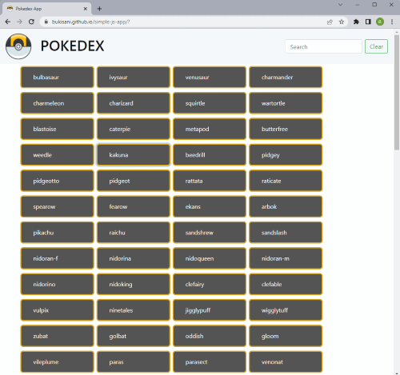

# Pokedex App

The app loads and presents data from an external API using jQuery

## Key Features

The user can view Pokemon details by clicking on the Pokemon name which opens a modal with with pokemon details.
The user can also search for specific Pokemon buy using the search input box.

[]

## Built with

The languages and tool I used for this project are:

- [Vs Code](https://code.visualstudio.com/)
- [HTML5](https://developer.mozilla.org/en-US/docs/Glossary/HTML5)
- [CSS3](https://www.w3.org/Style/CSS/Overview.en.html)
- [Bootstrap](https://getbootstrap.com)
- [JQuery](https://jquery.com)

## RoadMap

- [x] Add a search functionality
- [ ] Add loading Indicators
- [ ] User friendly error handling features

## Contribute

Any contributions you make are greatly appreciated.
If you have any suggestions that would make this better, please fork the repo and create a pull request.

## Authors

[Bukisani](https://bukisani.github.io/portfolio-website/index.html)

## Contact

[Bukisani](https://www.linkedin.com/in/bukisani-tshuma-323929237/)

 

[Project link](https://bukisani.github.io/simple-js-app/?)

## Acknowledgements

- [Pokemon API](https://pokeapi.co/)
- [Font Awesome](https://fontawesome.com)
- [GitHub Pages](https://pages.github.com)
- [Careerfoundry](https://careerfoundry.com)
